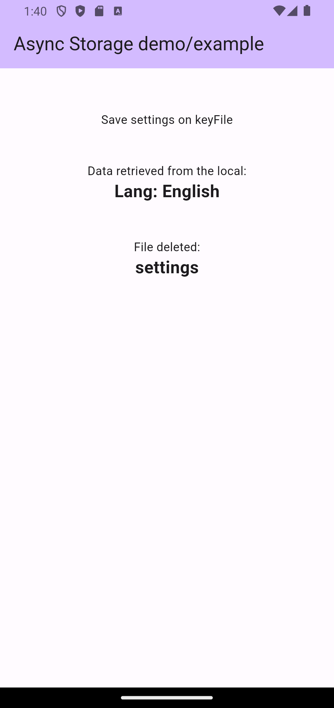

The package Async_Storage_Local is to save/write and read a string to local storage. If you are familiar with AsyncStorage in React/React Native, this is a close counter part in flutter environment. 
It's a class with three fucntionalities of write/save, read, and delete. Declare a class variable in your STATEFUL widget
with "keyFile" property. Then, saving and reading are done by .saveSting() and .readString() respectively.
It saves data in Stinrg. Stringify (via jsonEncode) any json data to store/save and convert the retrieved data to json format via jsonDecode. It was tested fine with a couple of kB of data string. 


☕ Buy me a coeffee ☕︎ 
<!--START_SECTION:buy-me-a-coffee -->
https://buymeacoffee.com/jeffk388
<!--END_SECTION:buy-me-a-coffe -->

## Features
- Easy to save/write and read a String data.
- Delete the file if not necessary.

<!-- - YouTube link: https://www.youtube.com/watch?v=YWt3sW1uuZ0 -->




## Getting started

Github provide an example.

## Usage
Add to the pubspec.yaml:
```dart
flutter pub add async_storage_local
```
Import the package:
```dart
import 'package:async_storage_local/async_storage_local.dart';
```
- The parent widget calling the package should be STATEFUL
- declare your local AsyncStorageLocal and dataStringRetrieved:
    \_ eg:
    ```dart
    AsyncStorageLocal fileSetting =AsyncStorageLocal(keyFile: 'settings');
    String dataStringRetrived='';
    //optional
    String fileDeleted='';
    ```
- Place the code set in any place takeing functions (eg, onPress, initState,-blocks):
    ```dart
    InkWell(
        onTap: (){
        fileSetting.saveString('Lang: English');
        },
        child: const Text(
        'Save settings on keyFile',
        ),
    ),
    ```
- To retrieve the string use .readSting()
    ```dart
    onTap:(){
        fileSetting.readString().then((value) {
            setState((){
            dataStringRetrived=value;
            });
        });
        },
    ```
\_ Then, the retrived string is "dataStringRetrived". The data is accessed like:

    ```dart
        ...
        Text(dataStringRetrieved,style:TextStyle(...)),
        ...
    ```
\_ As state earlier, the dataStringRetrived needs to be decoded to convert into a json if the saved is an encoded json. The data string size can be a couple of kB.


## Additional information

Please refer my Github site for details.
# async_storage_local

